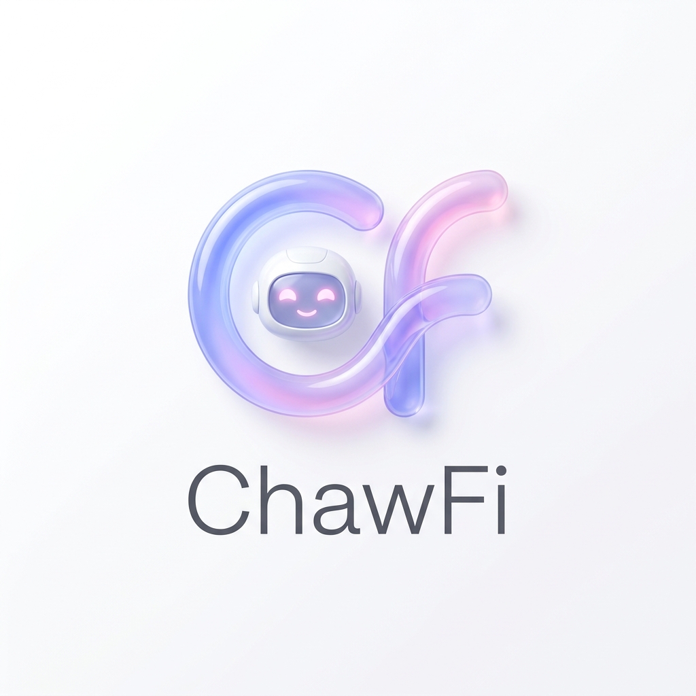
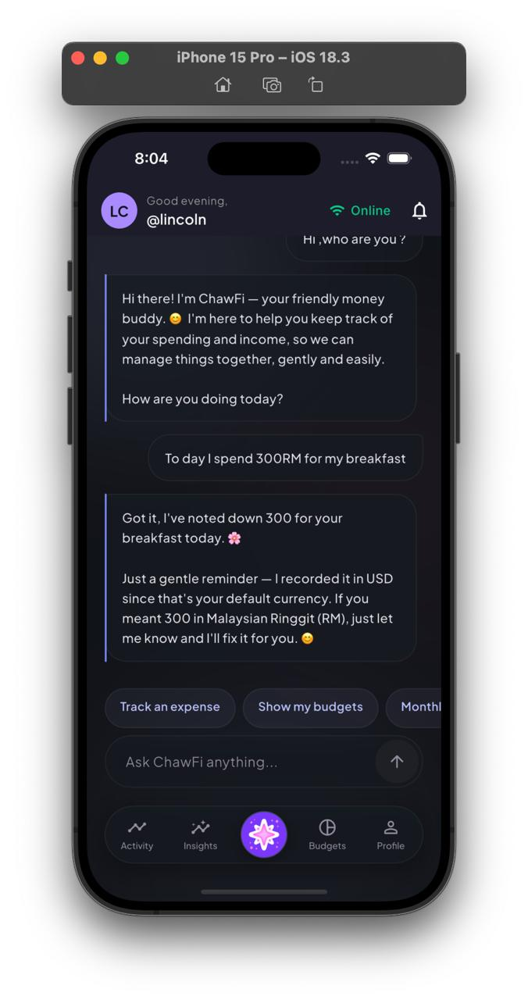
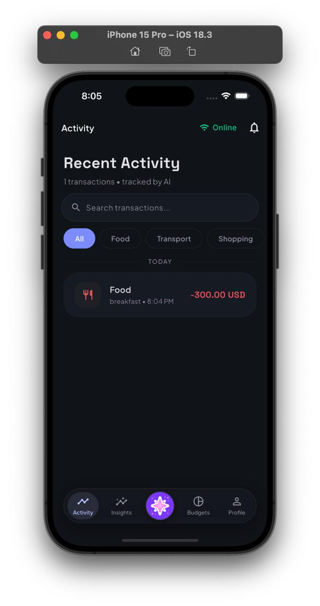
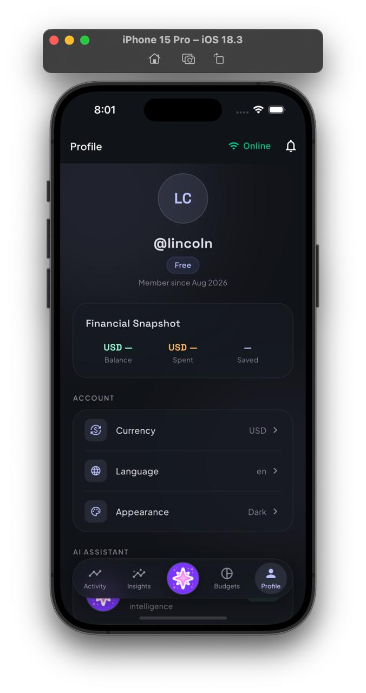

<div align="center">



# ChawFi

### Don't track money. Talk about it.

**Your conversational money manager.**

Tell ChawFi what you spent or earned in the same way you would send a message to a friend.  
ChawFi turns the conversation into organized financial records you can search, update, and understand later.

<br />


</div>

---

## Money tracking shouldn't feel like work

Most finance apps still make you do this:

`Amount → Type → Category → Date → Note → Save`

With ChawFi, you can simply say:

> **"Spent RM12 on Grab and RM7 on coffee."**

ChawFi understands what happened and keeps your financial records up to date.

No spreadsheet.  
No repetitive forms.  
No jumping between multiple screens.

---

<div align="center">





</div>

---

## Just talk naturally

ChawFi is designed around conversation instead of rigid commands.

You can say things like:

> **"Lunch RM18."**

> **"Spent RM12 on Grab and RM7 on coffee."**

> **"Actually, coffee was RM6."**

> **"How much did I spend today?"**

> **"ဒီနေ့ lunch အတွက် RM25 သုံးလိုက်တယ်"**

ChawFi keeps the context of the conversation so you can continue naturally instead of starting over every time.

---

## What makes ChawFi different?

### Traditional expense tracker

You open the app, choose a transaction type, enter the amount, choose a category, select a date, write a note, and save.

### Spreadsheet + general AI

You maintain your records somewhere else, prepare the data, upload or paste it into an AI assistant, then ask questions about it.

### ChawFi

You simply talk.

ChawFi is where your financial records live, and conversation is how you manage them.

> **Generic AI can analyze the financial data you give it.  
> ChawFi is built to manage your financial data with you.**

---

## What ChawFi can do

### 💬 Record income and expenses through conversation

Tell ChawFi what happened naturally instead of filling out a form.

### 🔎 Find your transactions

Ask about recent or past transactions without manually searching through a list.

### ✏️ Correct mistakes conversationally

Changed your mind or entered the wrong amount?

> "Actually, coffee was RM6."

ChawFi can identify the transaction and update it safely.

### 🗑️ Delete with confirmation

ChawFi can prepare transaction deletions and confirm them before making the change.

### 📊 Understand your spending

Ask for summaries across different time periods and see where your money went.

> "How much did I spend today?"

> "Show me this month's spending."

### 🌍 Speak naturally across languages

ChawFi is being built for multilingual conversations, including English, Burmese, mixed-language messages, and other supported languages.

### 💱 Keep currencies separate

Transactions preserve their original currency so your financial history stays clear and accurate.

---

## Built for real conversations

ChawFi isn't designed around memorizing commands.

It can handle:

- Follow-up questions
- Missing information
- Corrections
- Recent transaction references
- Mixed-language messages
- Ongoing conversation context
- Safe confirmation before sensitive changes

The goal is simple:

> **You talk. ChawFi handles the tracking.**

---

## Why we're building ChawFi

People usually don't stop tracking money because they don't care.

They stop because tracking becomes another chore.

Spreadsheets need maintenance.  
Traditional finance apps need repeated input.  
General AI still needs you to bring the financial data to it.

ChawFi is being built to remove that friction.

Instead of learning how to use another finance tool, you use the interface you already know:

**conversation.**

---

## How it works

```text
You
 │
 │  "Spent RM12 on Grab and RM7 on coffee"
 ▼
ChawFi
 │
 ├── understands the request
 ├── validates the financial action
 ├── updates your records
 └── explains what happened
 ▼
Your financial data
```

Behind the conversation, ChawFi keeps financial actions grounded in the backend rather than letting the AI guess.

**AI understands. Backend validates. Backend executes. AI explains.**

---

## Privacy and reliability

Financial data needs more than a clever chatbot.

ChawFi is being built with:

- 🔒 Secure data transmission
- 🛡️ Protected sessions and storage
- 👆 Biometric authentication support
- ✅ Backend-validated financial actions
- 🚫 No guessing when financial information is unclear
- 🔁 Durable processing for important actions
- 🔑 Support for user-provided AI providers where available

Your financial records remain structured data — not just text inside a chat.

---

## Coming next

ChawFi is still actively being developed.

Planned areas include:

- 💰 Budget management
- 🎯 Financial goals
- 🧠 Personalized financial insights
- 🔔 Smarter proactive notifications
- 🧾 Receipt OCR
- 🎙️ Voice interaction
- 🧠 Longer-term financial preferences and memory

These features will be introduced gradually as the core money-management experience becomes ready for release.

---

## Status

🚧 **ChawFi is currently in development.**

The first mobile release is being built for:

- 🍎 iOS
- 🤖 Android

Public availability will be announced when the first release is ready.

If you're following the project early, welcome. ✨

---

<div align="center">

## ChawFi

### Don't track money. Talk about it.

**Your conversational money manager.**

Built to make everyday money management feel less like work.

<br />

**Coming soon.**

<br />

ChawFi © 2026

</div>
